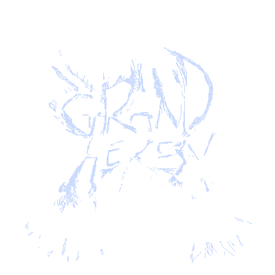

# Grand Heresy
--------------

Grand Heresy is a cooperative twin-stick shooter. Created for the UCSC senior capstone project. More information about our team or our game below.

Key Gameplay Features:

- **Features**: Explanation
- 

About the Team
--------------
- Producer/Designer & Generalist Programmer: [Sam Vik](https://github.com/samhvik) 
- AI Programmer: [Lane Albrecht](https://github.com/LaneAlb)
- Gameplay Programmer, 2D/3D Artist, Animator: [Josue Uriarte](https://github.com/JosueUriarte)
- UI & Generalist Programmer: Justin Quan
- Level Designer & General Programmer: Kevin Chacko
- Camera/Controls & Multiplayer Programmer: Danny Baghdasarians
- General Programmer: Quinn Satow
- 3D Artist: Zhe Kou
- Sound Designer: Jerry Lin
- Sound Designer: Satvik Srinivasan

Installation
------------
*Put the Link to Download here*
